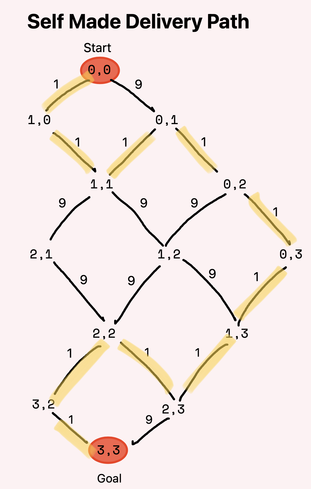

## Task 1
### Peter's Journey to Solve City and Network Problems

Before working on an implementation to find the shortest path I started with storing the graph. I also did this with [task 2](#task-2). The data structure that I used to achieve this is an adjacency list because it makes queuing up the nodes to be visited a bit easier than using an adjacency matrix.

I made a class that will be our `Graph` in order to have a function that can add edges and perform the `shortestpath()` operation we are wanting to achieve. When initiating a graph it takes in one parameter in order to create that many nodes.

The constructor for this class looks like this:

``` python
class Graph:
    def __init__(self, size):
        self.nodes = size + 1
        self.adj_list = {}
        self.path = {}

        for node in range(0, self.nodes):
            self.adj_list[node] = []
            self.path[node] = []
```

So in order to model the graph we were given we would initiate a graph with 8 nodes (0-7) and start adding the edges we need, printing the graph/adjacency list would look like this:

```
node x can reach [[y, weight], ... , [z, weight]]
node 0 can reach [[1, 2], [7, 3], [3, 2]]
node 1 can reach [[4, 4], [0, 1]]
node 2 can reach []
node 3 can reach [[0, 1], [5, 7]]
node 4 can reach [[6, 4]]
node 5 can reach [[6, 2]]
node 6 can reach []
node 7 can reach [[4, 4], [5, 6]]
```

After ensuring the graph was modeled correctly in order to find the shortest path I used Dijkstra's algorithm to find the shortest paths. The function returns an array with the minimum distance to each node as well as the path taken to get to it. Using the graph given while trying to find the shortest path from node 0 to 5, 6, 7 we get this output:

```
start | goal | shortest distance | path taken
 0    |  5   |  9                | [0, 3, 5]
 0    |  6   |  10               | [0, 1, 4, 6]
 0    |  7   |  3                | [0, 7]
```

This task was fairly straight forward, only tweak that had to be done from a basic Dijkstra's algorithm approach was to use a priority queue in order to take into account the different weights of the nodes.

## Task 2
### Optimal Delivery Route Planning 

I found this graph/grid particularly challenging to model at first since you can move in two directions left, indicating movement in the y-axis, and right, movement in the x-axis, I started implementing a linked list/tree graph of sorts. This made the most sense to me since the way the grid is presented is in the shape of a graph/tree with nodes. The more I implemented it the harder it became to know properly perform A*. This is where I changed my approach and went with what is my final data structure to hold the data of the graph, a 2D matrix.

In order to keep track of the cost to move in the x direction and the cost to move in the y direction I made a Cell class to hold this data as well as the f, g, and h of each cell for better integration with the A* algorithm. This resulted to be way easier compared to using a linked list/tree. Using the example given the grid will look like this:

```
[cost_x: 4, cost_y: 2  , cost_x: 3, cost_y: 1  , cost_x: -1, cost_y: 4 , -1]
[cost_x: 3, cost_y: 3  , cost_x: 4, cost_y: 2  , cost_x: -1, cost_y: 5 , -1]
[cost_x: 7, cost_y: -1 , cost_x: 1, cost_y: -1 , cost_x: -1, cost_y: 3 , -1]
[-1                    , -1                    , cost_x: -1, cost_y: -1, -1]
```
Note: a cost of -1 means that there is not a path when moving towards that direction

The Cell class is modeled like so:

``` python
class Cell:
    def __init__(self, cost_x, cost_y):
        self.cost_x = cost_x
        self.cost_y = cost_y
        self.parent_x = 0
        self.parent_y = 0
        self.f = float('inf')
        self.g = float('inf')
        self.heuristic = 0 
```

Having a Cell for every \[row\]\[col\] lets us keep track of the cost of multiple values needed to figure out where to move to next like the cost of getting there, the heuristic, the combined cost of both to make a decision of where to move as well as the parent in the x and y direction to help us with traversing the grid later on to print out the result. 

Performing A* with the example graph will give out the following output:

```
path found after performing astar: (with cost of 11):
(start) -> (0, 0) -> (0, 1) -> (1, 1) -> (1, 2) -> (2, 2) -> (2, 3) -> (end)
```

Now to mimick the real world scenario of having a complete path blocked off and having to take a detour I am making this graph and forcing it to go back a space and take a different path. I will be clearly setting the path that it should go on to make sure the algorithm does the correct backturns. The grid looks like this:

{ height=25% }

I'm making it to where, for us, it is fairly obvious that it should take all the paths highlighted in the picture above (all the paths that have a cost of 1) and avoid the intersections with a cost of 9 like `1, 1` and `1,2`. First we add the coordinates to the grid with the appropriate x, y costs and get this as the grid to use:

```
[cost_x: 1, cost_y: 9  , cost_x: -1, cost_y: 1 , -1                    , -1                    ]
[cost_x: 1, cost_y: 1  , cost_x: 9, cost_y: 9  , cost_x: -1, cost_y: 1 , -1                    ]
[cost_x: 9, cost_y: 1  , cost_x: 9, cost_y: 9  , cost_x: 1, cost_y: 1  , cost_x: -1, cost_y: 1 ]
[cost_x: 1, cost_y: -1 , cost_x: 1, cost_y: -1 , cost_x: -1, cost_y: -1, cost_x: -1, cost_y: -1]
```

In order for us to take into account the cost of going backwards I implemented a direction loop that will look at all the directions in the + and - x and y directions. If a cell is being explored and it is a *previous* cell in the sense that it went backwards then we add the cost of the current node of the opposite direction. For instance if our current node is `1,1` and the next node we are looking at is in the -x direction (`0,1`) then we have to add the cost of moving in the x direction of the next node and not the current node. This is part of the main while loop that drives the A* algorithm:

```python
directions = [(0, 1), (1, 0), (0, -1), (-1, 0)]

for x, y in directions:
backwards = False
new_col = cur_col + x 
new_row = cur_row + y 

if (not self.is_inbound((new_col, new_row))):
    continue

new_cell = self.grid[new_row][new_col]

if (self.is_available((new_col, new_row)) and
    not visited[new_row][new_col]):

    if (x == 1):
        cost = cur_cell.cost_x
    elif (x == -1):
        cost = new_cell.cost_x
        backwards = True

    if (y == 1):
        cost = cur_cell.cost_y
    elif (y == -1):
        cost = new_cell.cost_y
        backwards = True

    if (cost == -1):
        continue

# ... more after this to update g, f and h, find if the new node is the goal node and some other things
```

After processing the grid with the A* algorithm we get the desired output of:

```
path found after performing astar: (with cost of 10):
(start) -> (0, 0) -> (1, 0) -> (1, 1) -> (0, 1) -> (0, 2) -> (0, 3) -> (1, 3) -> (2, 3) -> (2, 2) ->
 (3, 2) -> (3, 3) -> (end)
```

## Task 3
### Randomized Hill Climbing (RHC) for Resource Allocation

For this task I found making a generalized RHC function helpful and abstracting parts of it to make it more expressive and digestible. For instance my RHC function looks like this:

```python
def rhc(projects, objective_function, iterations=1000):
    current_allocation = random_allocation(projects, total_resources)
    current_value, _ = objective_function(current_allocation)
    
    for _ in range(iterations):
        new_allocation = explore_neighbor(current_allocation, projects)
        new_value, comparison_type = objective_function(new_allocation)
        
        if (comparison_type == 'max' and new_value > current_value) or \
           (comparison_type == 'min' and new_value < current_value):
            current_allocation = new_allocation
            current_value = new_value
    
    return current_allocation, current_value
```

It is fairly short and a higher order function in order to receive an objective function as a parameter letting me implement what ever function I want, have it be maximizing time or benefit or minimizing time or cost. There are only two types of optimizations that RHC takes, min or max so this functions makes the assumption that the `objective_function` will return the type of comparison and optimization that is supposed to make. Doing this let me create one function for maximizing benefit and another for minimizing time and passing them as parameters to this function.

This is mostly it, everything that was left was to pass an object of projects and let the algorithm run its iterations and print the output. My test cases looked like this:

``` python
test_cases = {
        1: [{'id': 1, 'requirement': 20, 'benefit': 40},
            {'id': 2, 'requirement': 30, 'benefit': 50},
            {'id': 3, 'requirement': 25, 'benefit': 30},
            {'id': 4, 'requirement': 15, 'benefit': 25}],

        2: [{'id': 'A', 'requirement': 10, 'time': 15},
            {'id': 'B', 'requirement': 40, 'time': 60},
            {'id': 'C', 'requirement': 20, 'time': 30},
            {'id': 'D', 'requirement': 25, 'time': 35},
            {'id': 'E', 'requirement': 5, 'time': 10}],

        3: [{'id': 'X', 'requirement': 50, 'benefit': 80},
            {'id': 'Y', 'requirement': 30, 'benefit': 45},
            {'id': 'Z', 'requirement': 15, 'benefit': 20},
            {'id': 'W', 'requirement': 25, 'benefit': 35}]
        }
```

And my output, using a budget of **100 units** was:

```
allocation for test case 1: 
{'id': 1, 'requirement': 20, 'benefit': 40}
{'id': 2, 'requirement': 30, 'benefit': 50}
{'id': 3, 'requirement': 25, 'benefit': 30}
{'id': 4, 'requirement': 15, 'benefit': 25}
total benefit: 145 
===========================================================================
allocation for test case 2: 
{'id': 'A', 'requirement': 10, 'time': 15}
{'id': 'B', 'requirement': 40, 'time': 60}
{'id': 'C', 'requirement': 20, 'time': 30}
{'id': 'D', 'requirement': 25, 'time': 35}
{'id': 'E', 'requirement': 5, 'time': 10}
total time: 150
===========================================================================
allocation for test case 3: 
{'id': 'X', 'requirement': 50, 'benefit': 80}
{'id': 'Y', 'requirement': 30, 'benefit': 45}
{'id': 'Z', 'requirement': 15, 'benefit': 20}
total benefit: 145
===========================================================================
```

I wanted to test it with a more restrictive budget since a budget of 100 is fairly big for what the projects cost, so for this second round of testing I decreased the budged down to 60. I got these results:

```
allocation for test case 1: 
{'id': 1, 'requirement': 20, 'benefit': 40}
{'id': 2, 'requirement': 30, 'benefit': 50}
total benefit: 90
===========================================================================
allocation for test case 2: 
{'id': 'A', 'requirement': 10, 'time': 15}
{'id': 'E', 'requirement': 5, 'time': 10}
{'id': 'C', 'requirement': 20, 'time': 30}
total time: 55
===========================================================================
allocation for test case 3: 
{'id': 'X', 'requirement': 50, 'benefit': 80}
total benefit: 80
===========================================================================
```

This aligns with the best case scenario for each objective function and test case.
